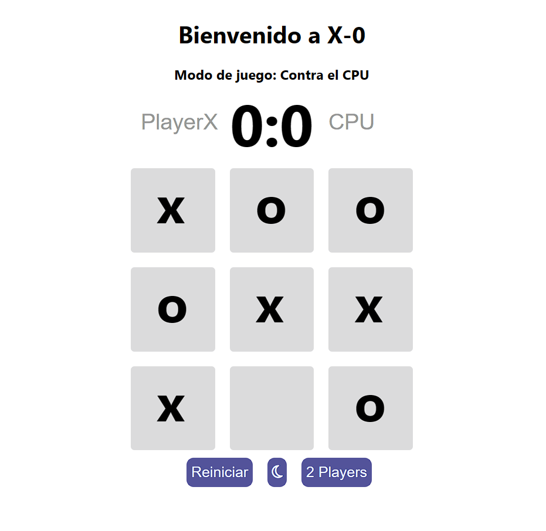
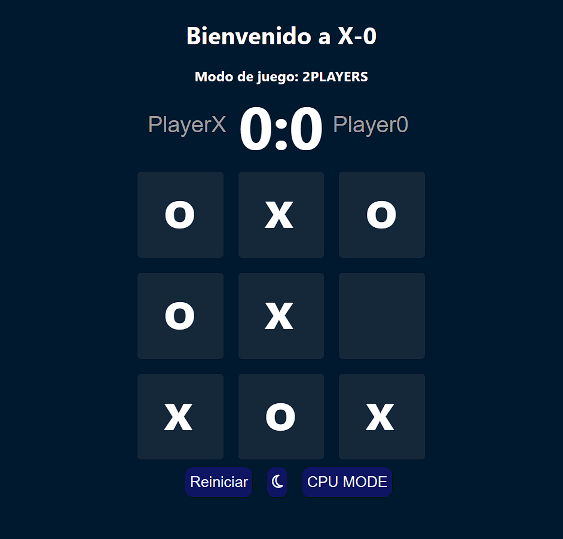

# Tic-Tac-Toe: Juego de Equis Cero

¡Bienvenido a Tic-Tac-Toe, el clásico juego de Equis Cero para todos!
Ingresa a https://franciscobaltodano.github.io/tic-tac-toe/

## Nuevo modo de Juego!!
El modo de juego CPUmode ha llegado a Tic-Tac-Toe!
Ahora disfruta jugar contra el CPU.

## Funcionalidades
- **Modo Oscuro:** Disfruta del juego tanto de día como de noche.
- **Juega contra un amigo:** Desafía a tus amigos y familiares en emocionantes partidas de Tic-Tac-Toe.

### Modo Claro

### Modo Oscuro

## Cómo Jugar
1. **Xs y Os:** El jugador 1 es X y el jugador 2 es O.
2. **Tablero 3x3:** Elige un espacio vacío en el tablero para colocar tu marca.
3. **Gana el primero:** El primer jugador en completar una fila horizontal, vertical o diagonal con sus marcas gana el juego.

¡Diviértete jugando Tic-Tac-Toe y buena suerte!

